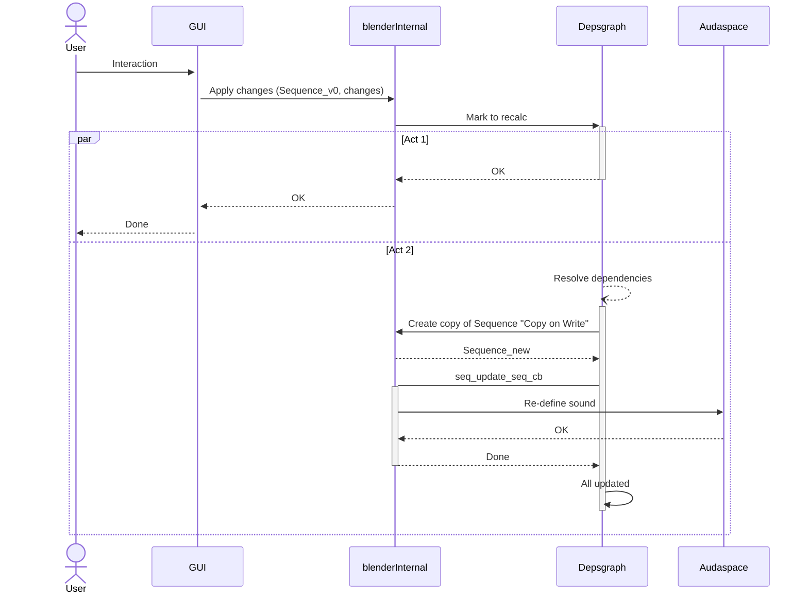

# Study of dynamic behaviour

## Basic concepts

 * There is always an "Original Sequence", I call it "v0"
 * In any change there is a "new" Sequence, which we could call it
   "Copy-on-write version"
 * Sequences are not "first-class members in Blender". They are pointed by a
   Scene.
### Editing audio

As a general rule, when the user makes a change in a *Strip*, the GUI with the
help of RNA and BlenderInternal, it changes the data model (*Sequence struct*).
Then it marks as dirty in the *Depsgraph*.
Later, *Despgraph* will try to resolve the dependencies, usually duplicates de
*Scene* and in the *callback* of changes in *Sequence struct*
(seq_update_seq_cb) is where Blender dialogues with Audaspace in order to
reflect the changes.

It's very important to remember that the "*Sequence struct v0*" has NO relation
with the Audaspace World. It is the "*Sequence struct Copy-on-write*" which hast
that relation, and that's the reason why the changes have to be done later.

This relation is a std::shared_ptr<SequenceEntry>.
